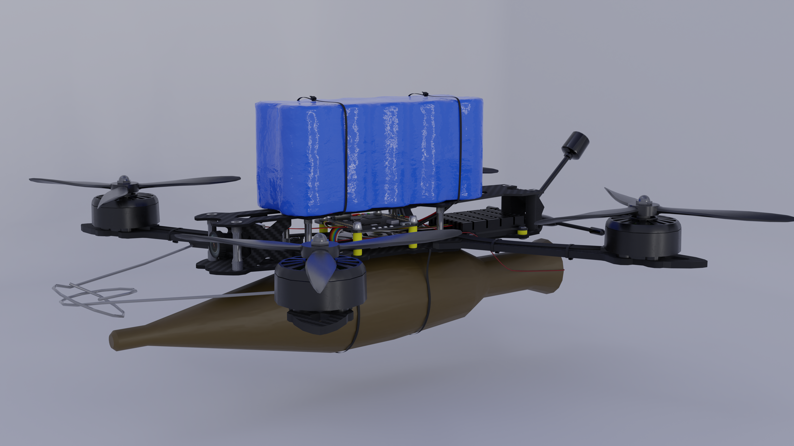
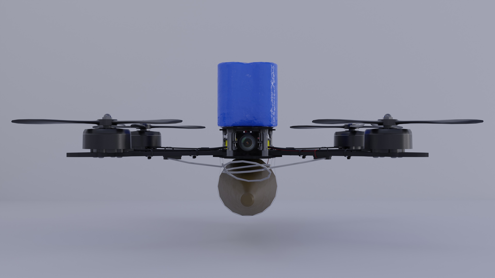
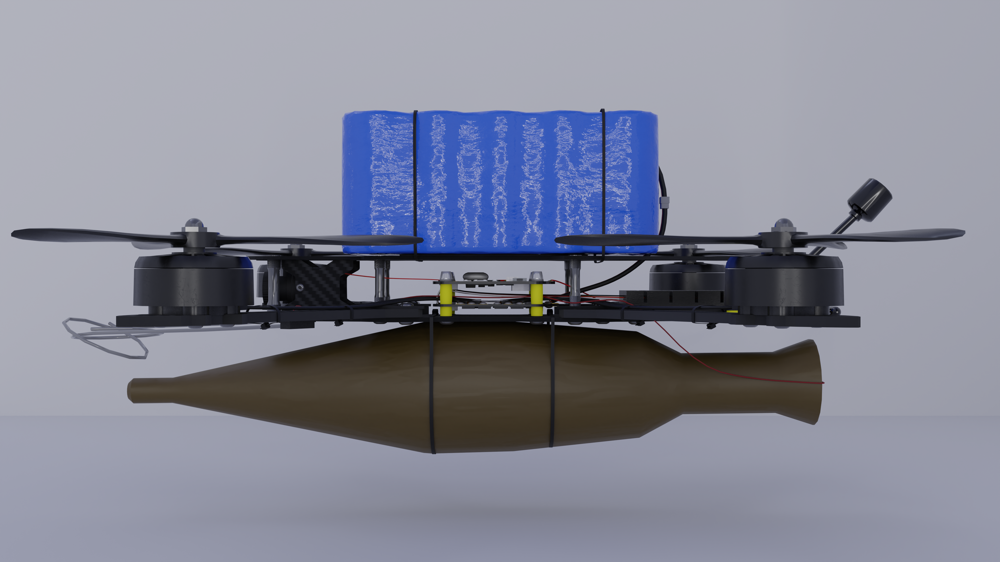
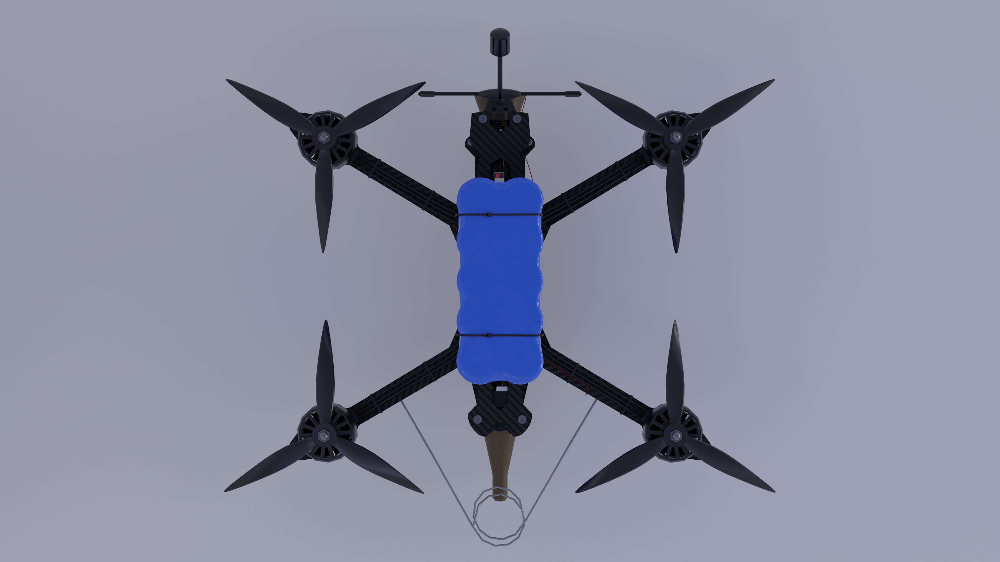
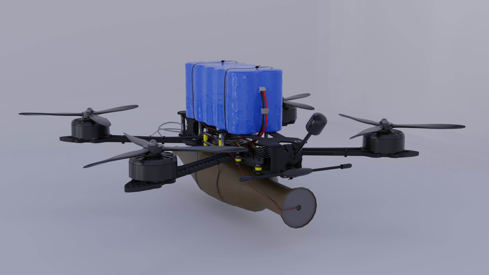
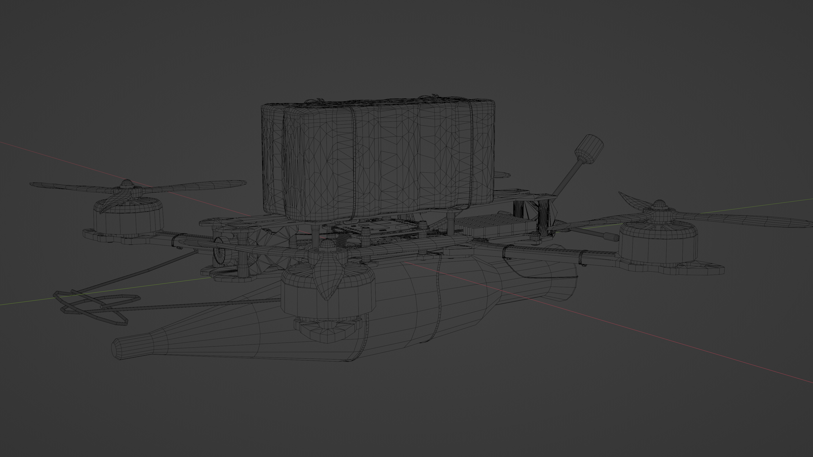
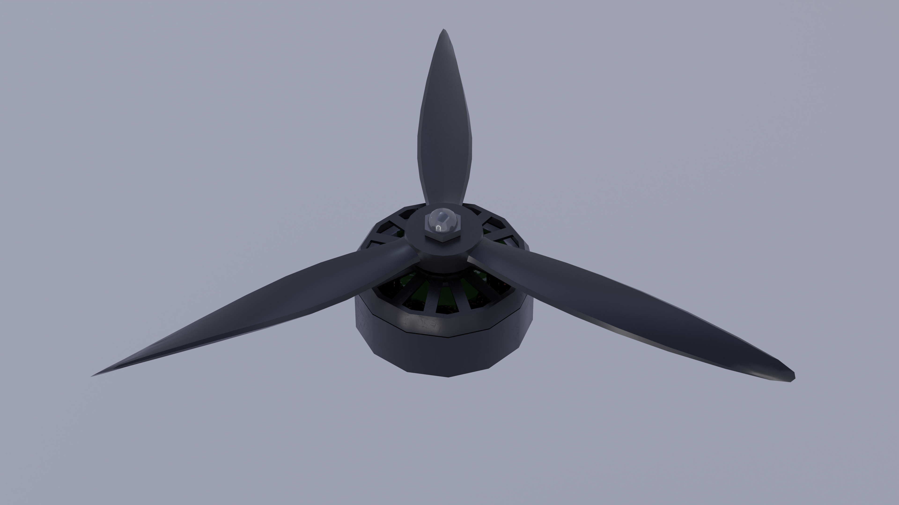
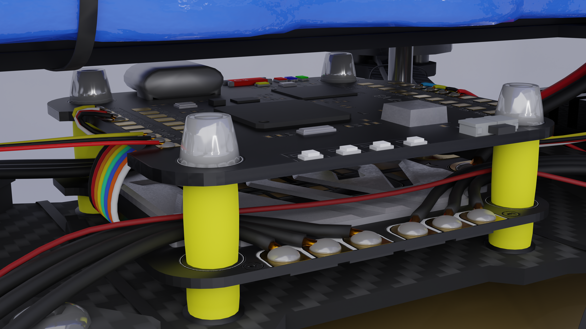

**English** | [Українська](README_UA.md)

# Military FPV Kamikaze Drone 3D Model

**Software:** Blender  
**Category:** Hard-Surface / Technical Modeling  
**Video Overview:** [Google Drive](link_will_be_added_later)

---

## Project Description

Detailed 3D model of a strike FPV drone built on a carbon frame. The project replicates the complete assembly of a kamikaze drone with a PG-7 shaped charge payload, initiation system, and battery pack.

---

## Structural Elements & Detailing

* **Frame & Mechanics:** Carbon fiber structural frame with PCB plates, aluminum standoffs, brushless motors, and 3-blade propellers.
* **Initiation Circuit:** Warhead (PG-7) secured with nylon zip ties, detonator control board, routed wiring, and front contact loops ("detonation whiskers").
* **Electronics & Communication:** Flight controller and ESC stack with silicone anti-vibration dampers, smoothing capacitor, power wiring, external mount, and video antenna (VTX).
* **Power:** Assembled Li-Ion battery pack in blue heat shrink tubing with exposed power cable.

---

## Render Gallery

### Main Angles

| Beauty Render | Front View |
| :---: | :---: |
|  |  |

| Side View | Top View |
| :---: | :---: |
|  |  |

| Back View | Wireframe Topology |
| :---: | :---: |
|  |  |

---

## Component Detailing

| Motor & Rotor Assembly | Electronics Stack & Detonator |
| :---: | :---: |
|  |  |
