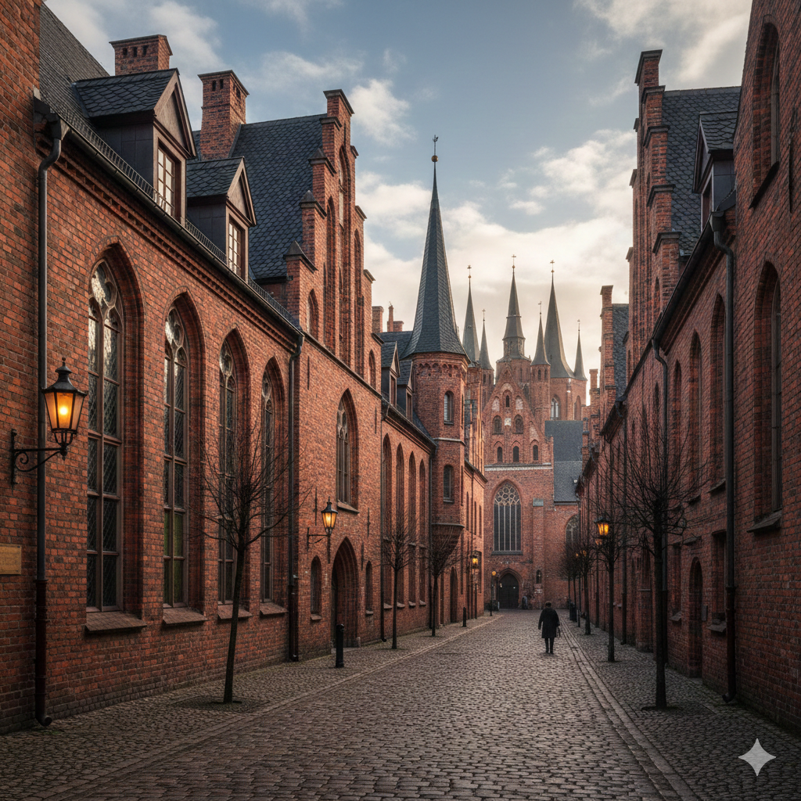
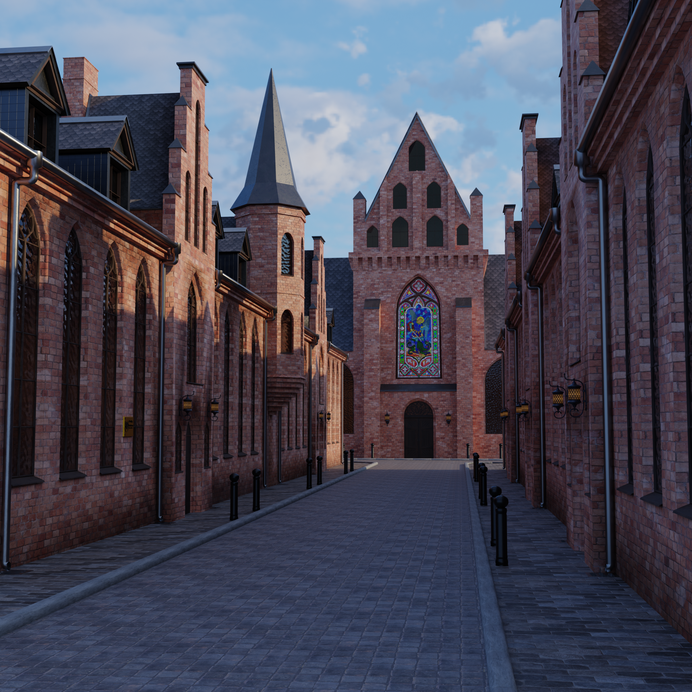
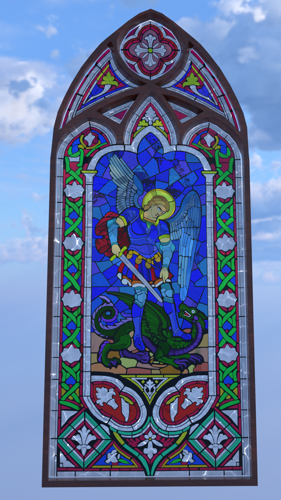
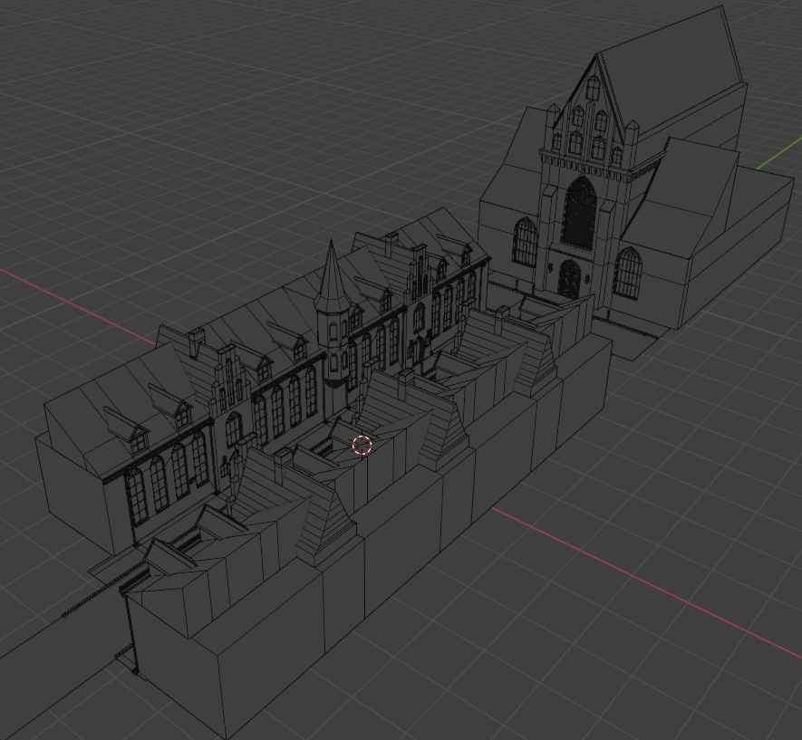
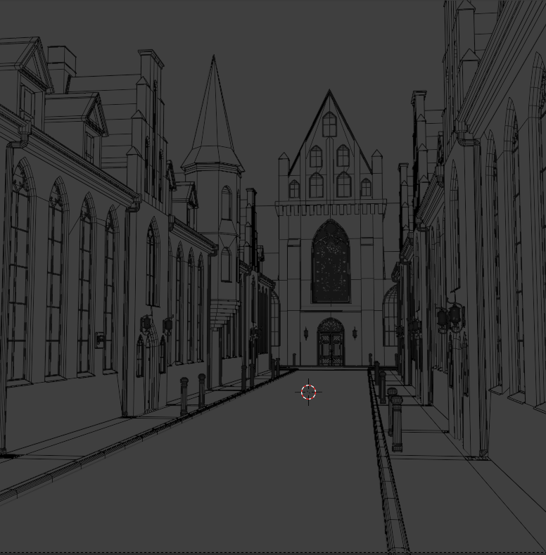

**English** | [Українська](README_UA.md)

# Neogothic Street AI Concept 3D Adaptation

**Software:** Blender  
**Category:** Environment Design / Architecture / AI-to-3D Pipeline  

---

## Project Overview

A project dedicated to translating an AI-generated 2D concept of an atmospheric street into a full 3D scene. The main goal was to accurately model the detailed architectural environment while capturing the overall mood and aesthetic of the original reference image.

---

## Technical Highlights

* **AI to 3D Pipeline:** Recreating the overall architectural composition and forms from the generated image into clean 3D geometry.
* **Stained Glass Modeling:** The central stained glass window depicting Archangel Michael was constructed entirely by hand. Every individual glass cell and metal frame line is modeled as distinct physical geometry rather than a flat texture or alpha map.
* **Neogothic Architecture:** Detailed modeling of key architectural elements—stepped gables, lancet window openings, drainage pipes, street lamp brackets, and brick facade layouts.

---

## Gallery & Wireframe

### AI Concept vs 3D Render

| Original AI Concept | Final 3D Render |
| :---: | :---: |
|  |  |

---

## Geometry & Topology

| Stained Glass Geometry | Scene Overview (Wireframe) |
| :---: | :---: |
|  |  |

| Street View Topology |
| :---: |
|  |
