**English** | [Українська](README_UA.md)

# St. Florin Cathedral 3D Model (Vaduz)

**Software:** Blender  
**Category:** Architecture 3D Modeling / Environment Design  
**Architectural Style:** Neogothic (Gothic Revival)  

---

## Project Overview

A 3D model of the Cathedral of St. Florin, the iconic landmark of Vaduz, Liechtenstein, originally built in 1873 by architect Friedrich von Schmidt.

The project focuses on accurately capturing the Neogothic architectural proportions, key structural details, and overall facade composition.

---

## Technical Highlights

* **Architectural Elements:** Detailed modeling of the clock tower, spire, lancet windows, decorative pinnacles, and the top cross.
* **Facade Details:** Included Liechtenstein national flags and stone facade modeling.
* **Clean Topology:** Optimized wireframe and clean geometry suitable for architectural visualization.

---

## Gallery & Wireframe

### Main Renders & Environment

| Environment Render | Front Facade | Perspective View |
| :---: | :---: | :---: |
| 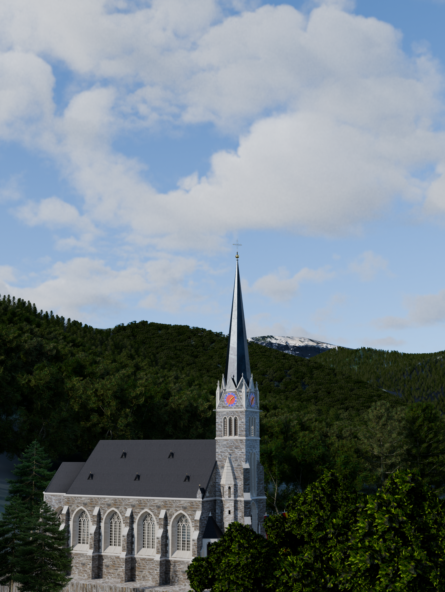 | 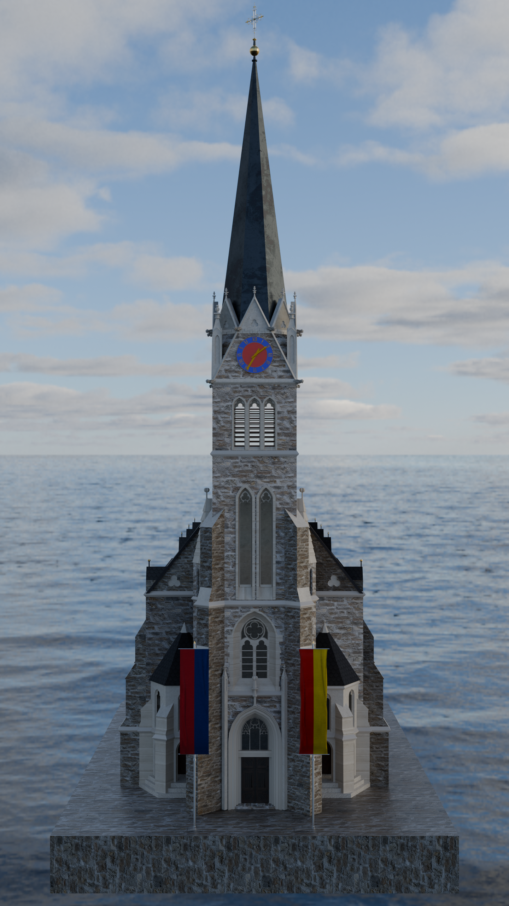 | 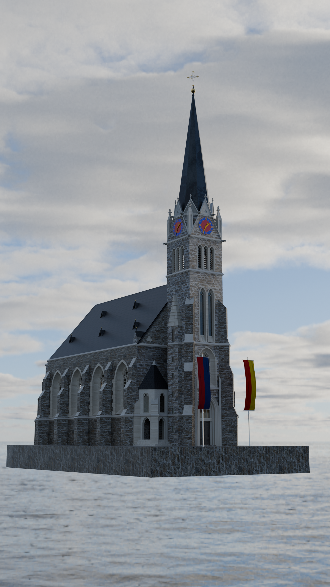 |

| Side View | Top View |
| :---: | :---: |
| 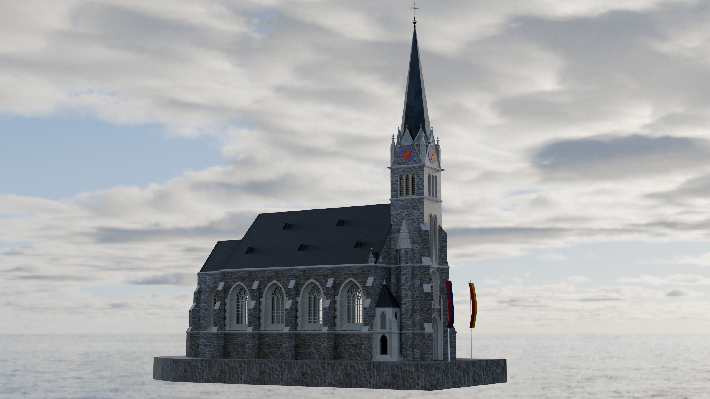 | 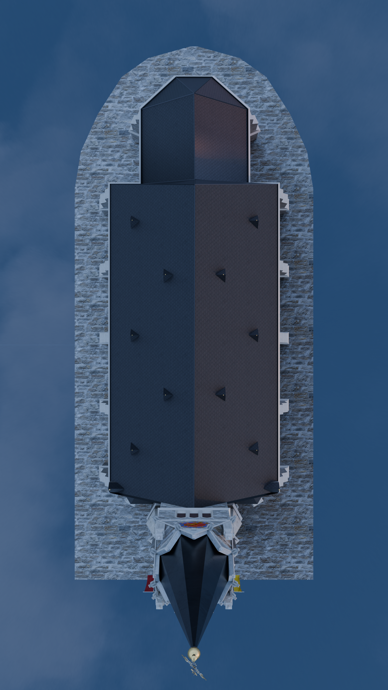 |

---

### Architectural Details

| Clock Tower | Clock Close-up | Entrance with Flags | Spire Cross |
| :---: | :---: | :---: | :---: |
| 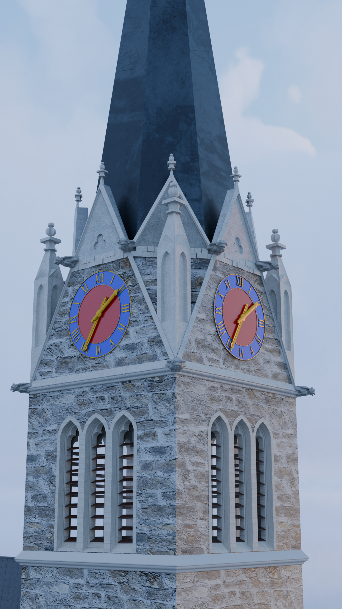 | 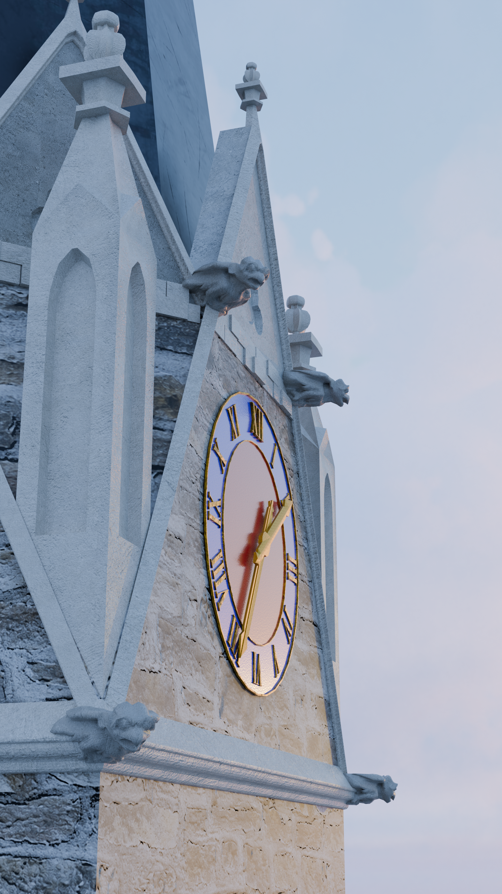 | 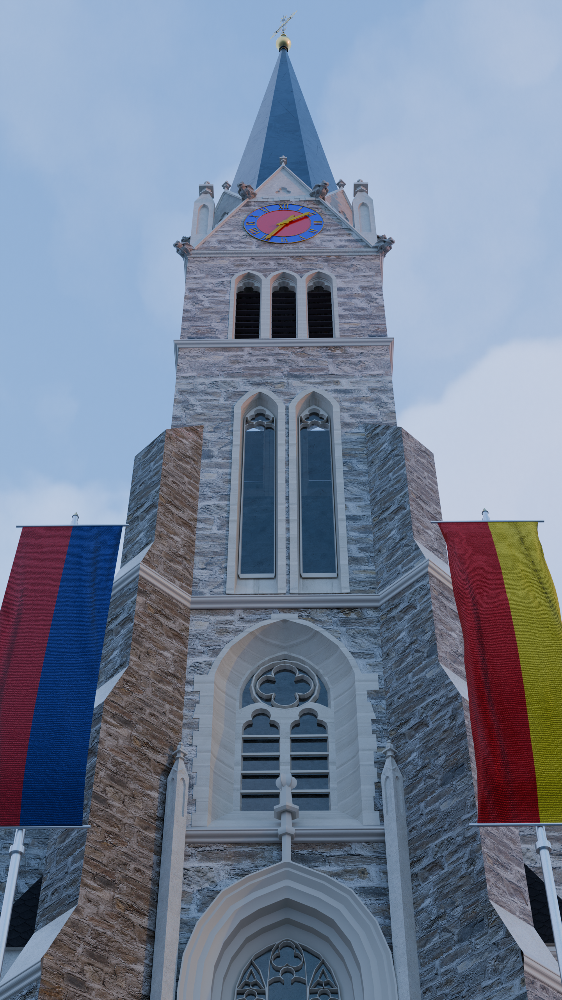 | 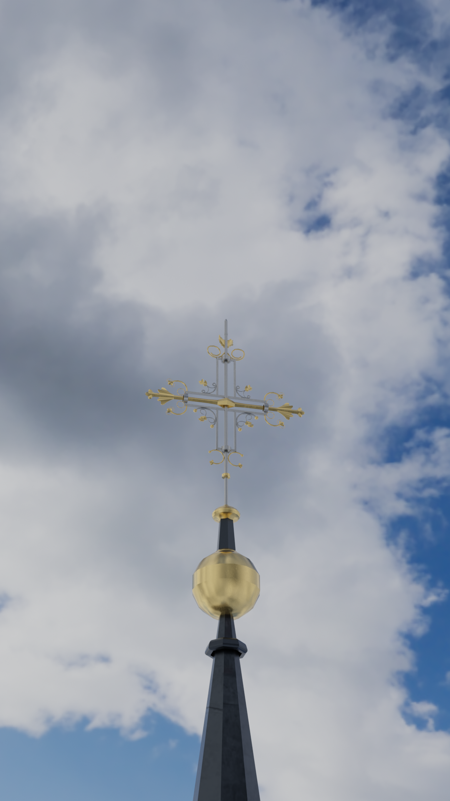 |

---

### Topology (Wireframe)

| Perspective Wireframe | Front Wireframe |
| :---: | :---: |
| 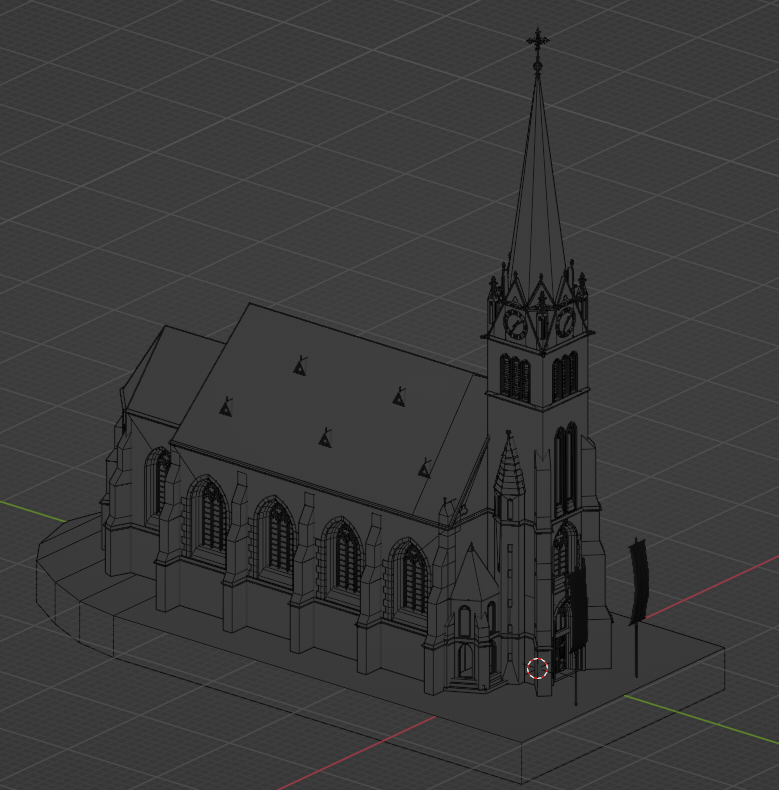 | 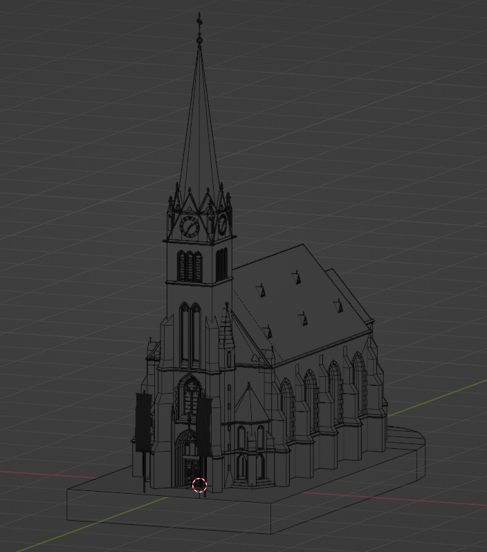 |
