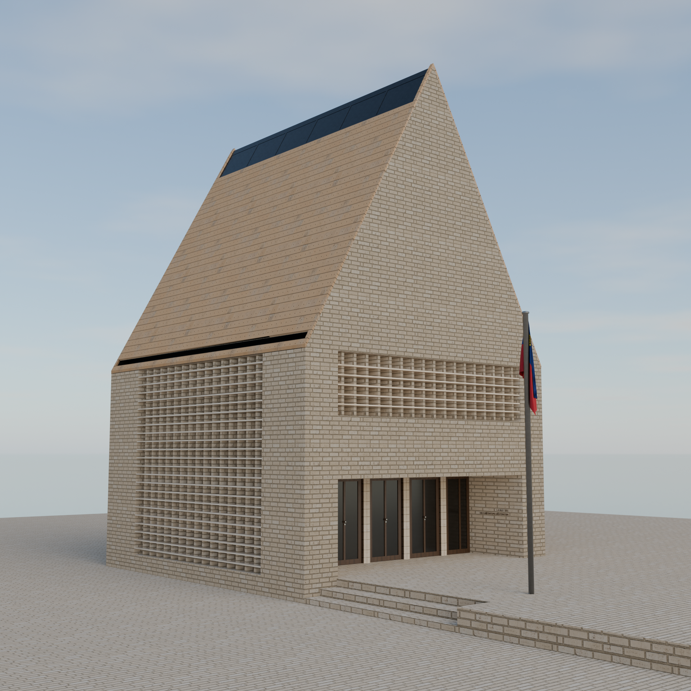
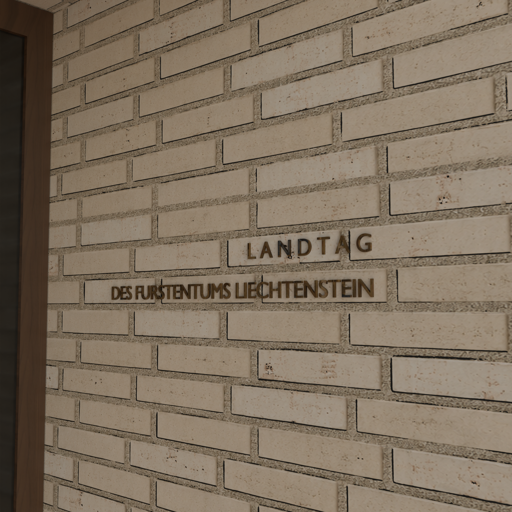

**English** | [Українська](README_UA.md)

# Liechtenstein Landtag 3D Model (Peter-Kaiser-Platz)

**Status:** Work in Progress (WIP)  
**Software:** Blender  
**Category:** Architecture 3D Modeling / Environment Design  
**Style:** Contemporary Architecture / Minimalism  

---

## Project Overview

A project focused on recreating the architectural ensemble of **Peter-Kaiser-Platz** in Vaduz — the political center of the Principality of Liechtenstein. 

Currently completed is the main modern parliament building — the **"High House" (Hohes Haus)**. The project is under active development.

---

## Development Roadmap

- [x] **"High House" (Hohes Haus):** Modeling the primary Landtag building, brick facade, lattice structures, and main entrance.
- [ ] **Connecting Parliament Building:** Modeling the second part of the modern complex (Verbindungshaus).
- [ ] **Historic Government House:** Recreating the historic parliament/government building (Regierungsgebäude).
- [ ] **Square Assembly:** Assembling the complete environment and layout of Peter-Kaiser-Platz.

---

## Technical Highlights

* **Facade Brickwork:** Detailed texture and geometry work for the signature light-colored brick cladding.
* **3D Entrance Lettering:** Hand-modeled volumetric text *“LANDTAG DES FÜRSTENTUMS LIECHTENSTEIN”* embedded into the exterior brick wall.
* **Architectural Details:** Modeling perforated brick lattice windows (sun-shading elements), steep pitched roof, and the national flag of Liechtenstein.

---

## Gallery

| Main Building View (Hohes Haus) | Facade Detail & Lettering |
| :---: | :---: |
|  |  |
